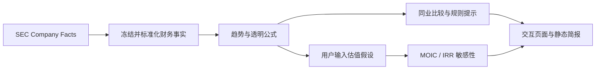

# 公司财务研究自动化

一个来源可追溯的财务研究 MVP：把 Microsoft、Oracle 和 NVIDIA 的冻结 SEC XBRL 示例数据转化为五年趋势、示例公司比较、规则化观察提示，以及由使用者自行输入假设的 MOIC/IRR 情景。

> 当前版本只支持仓库内预设的三个示例公司，不支持任意公司查询或文件上传。输出不构成投资建议、证券估值或目标价。



## 用途

公司研究经常先花时间抄录财务数据，再做口径统一、趋势分析和风险检查。本项目自动化可重复部分，同时让每个数字回到 SEC 来源，让每个计算回到公开公式。

适合用于：复核年度财务趋势、检查派生指标公式、比较预设示例公司，以及观察不同增长、倍数和净债务假设如何改变数学结果。不适合用于实时交易、自动选股或替代原始申报文件。

## 当前输入与输出

输入：

- 仓库内 `data/financials.csv` 的冻结年度财务事实；
- 页面中由使用者输入的增长率、进场/退出倍数、持有期和净债务假设；
- 可选的 SEC 刷新脚本。公司清单目前固定在脚本中。

输出：

- 营收增长、利润率、简化自由现金流、资本开支强度、现金转化和负债资产比；
- 三个预设公司的最新已申报年度比较；
- 只提出后续核查问题的规则化提示，不输出评级；
- MOIC、IRR 和增长率/退出倍数敏感性表；
- 带 SEC 来源链接的交互页面和静态简报。

## 情景公式

```text
退出指标 = 基期指标 × (1 + 年增长率) ^ 持有期
进入企业价值 = 基期指标 × 进入倍数
退出企业价值 = 退出指标 × 退出倍数
股权价值 = 企业价值 - 净债务
MOIC = 退出股权价值 ÷ 进入股权价值
IRR = MOIC ^ (1 ÷ 持有期) - 1
```

公式透明不等于假设正确。当前情景忽略分红、稀释、交易费用、税务、中途现金流和复杂资本结构，也不会自动取得市场价格或净债务。

## 快速运行

```bash
python -m venv .venv
source .venv/bin/activate
pip install -r requirements.txt
streamlit run app.py
```

运行测试并生成静态简报：

```bash
python -m unittest discover -s tests -v
python scripts/generate_report.py
```

刷新 SEC 快照：

```bash
export SEC_USER_AGENT="<your name> <your public contact email>"
python scripts/build_snapshot.py
```

SEC 要求自动访问者使用可识别的 User-Agent。冻结样例本身不需要配置；刷新时必须由运行者提供自己的真实、可公开联系信息。不要提交邮箱密码、API key 或其他密钥。GitHub Actions 会在仓库变量 `SEC_CONTACT_EMAIL` 已配置时才刷新，并在运行时组装 `SEC_USER_AGENT`；未配置时只运行测试。

## 数据来源与隐私边界

- 冻结示例来自美国 SEC `data.sec.gov` Company Facts API，范围和截取日期见 [DATA_CARD.md](DATA_CARD.md)；
- 本项目没有登录、用户账户、遥测或分析代码；本地运行时不会上传冻结 CSV；
- 在线刷新只向 SEC 发起请求，并发送运行者配置的 `SEC_USER_AGENT`；
- 当前版本没有文件上传功能，也不读取内部资料；不要把保密、个人或未公开数据加入仓库；
- 静态 CSV 和输出文件会保留在本地或 GitHub Actions artifact 中，发布前应自行检查内容。

## 自动化与人工判断的边界

自动化部分包括：读取与标准化公开事实、计算公式、同业表、规则提示、假设敏感性、数据校验、静态报告及 GitHub Actions 测试。

人工部分包括：会计口径复核、业务分部分析、同业选择、增长和倍数假设、净债务与交易结构、风险判断及最终投资决策。

## 已知限制

- 三家公司业务结构不同，不能因为放在同一表中就视为严格可比；
- 财年截止日不同，XBRL 标准标签不能覆盖所有公司特有披露；
- 简化自由现金流为经营现金流减资本开支，不等同于完整的 unlevered FCF；
- 总负债/总资产不是净债务，也不是信用评级；
- 情景模型不是 DCF、可比公司估值或真实 PE 回报模型；
- 公开公司示例不能替代私募项目的尽调、条款、稀释和退出路径分析；
- 重要结论必须回到原始申报文件核验。

## 尚未实现的通用化能力

- 页面中输入任意 CIK/ticker 并动态下载数据；
- 上传并映射用户自备 CSV；
- 自动识别公司特有 XBRL 标签和分部披露；
- 实时市场价格、净债务、可比倍数或目标价；
- 针对不同业务模型自动选择严格可比公司。

这些是未来扩展方向，不是当前功能。

数据范围见 [DATA_CARD.md](DATA_CARD.md)，静态样例见 [output/company_brief.md](output/company_brief.md)，AI 协作边界见 [AI_USAGE.md](AI_USAGE.md)。
