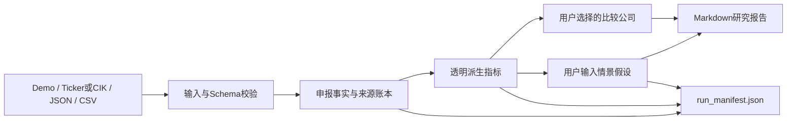

# 公司财务研究自动化

一个面向美国 SEC 公开申报数据的可追溯研究工具。使用者可以从冻结 Demo、在线 ticker/CIK、上传的 SEC Company Facts JSON，或同结构财务 CSV 开始，得到申报事实账本、透明派生指标、用户选择的公司比较、假设驱动的 MOIC/IRR 情景，以及可下载报告。

> 本项目不宣称支持全球任意公司。缺失或不兼容的 XBRL 事实保持缺失，不自动猜数；输出不构成投资建议、证券估值或目标价。



## 输入模式

### 1. 冻结 Demo

内置 Microsoft、Oracle 和 NVIDIA 的五年 SEC Company Facts 快照。完全离线运行，不需要环境变量或 API key。

### 2. 在线 SEC：ticker 或 CIK

页面接受最多五个以逗号或换行分隔的美国上市公司 ticker/CIK，并按使用者选择的财年区间展示结果。

在线请求不需要 API key，但 SEC 要求自动访问者使用可识别的 User-Agent。运行前在本地设置自己的真实姓名和公开联系邮箱：

```bash
export SEC_USER_AGENT="<your name> <your public contact email>"
streamlit run app.py
```

若 `SEC_USER_AGENT` 未配置、网络不可用、ticker 不存在或标准标签不匹配，页面会显示错误并停止，不生成替代数字。

### 3. 上传 SEC Company Facts JSON

上传从 SEC Company Facts 保存的 JSON。系统读取 `facts.us-gaap` 中受支持的标准年度 USD 标签，并保留 XBRL tag、accession、申报日期和来源 URL。可选 ticker 只作为显示标签，不会覆盖 JSON 内的 CIK、公司名或财务事实。

### 4. 上传同结构财务 CSV

页面提供结构示例下载。必填字段包括：

```text
ticker, company, fiscal_year, fiscal_year_end, filed, source_url,
revenue, gross_profit, cost_of_revenue, operating_income, net_income,
operating_cash_flow, capex, assets, liabilities, equity
```

财务字段可以为空，但不能缺少列；日期、来源 URL、重复公司年度和数值类型会被校验。上传来源由使用者负责核验。

## 输出

- **申报事实：** 收入、利润、现金流、资本开支、资产、负债与权益，只保留输入或 SEC 返回的值；
- **派生指标：** 营收增长、利润率、简化自由现金流、资本开支强度、现金转化和负债资产比；
- **用户选择的比较：** 只比较当前数据集中由使用者勾选的公司，不自动认定为严格可比公司；
- **用户假设情景：** 增长、进场/退出倍数、持有期与净债务和事实分开记录；
- **来源账本：** 公司年度、申报日期、accession、输入模式及公开来源；
- **下载：** Markdown 研究报告、申报事实 CSV 和 `run_manifest.json`。

`run_manifest.json` 保存输入模式、财年区间、公司范围、来源 URL、公式版本、用户假设、输入 SHA-256 和 `uploads_persisted=false`，用于复核本次运行的范围与方法。

## 情景公式

```text
退出指标 = 基期指标 × (1 + 年增长率) ^ 持有期
进场企业价值 = 基期指标 × 进场倍数
退出企业价值 = 退出指标 × 退出倍数
股权价值 = 企业价值 - 净债务
MOIC = 退出股权价值 ÷ 进场股权价值
IRR = MOIC ^ (1 ÷ 持有期) - 1
```

该情景没有计入分红、稀释、税、交易费用、优先权、追加投资、中途现金流或复杂债务结构，也不会自动取得市场价格或真实净债务。

## 快速运行

```bash
python -m venv .venv
source .venv/bin/activate
pip install -r requirements.txt
streamlit run app.py
```

运行测试并生成仓库内冻结 Demo 的静态简报：

```bash
python -m unittest discover -s tests -v
python scripts/generate_report.py
```

配置 `SEC_USER_AGENT` 后，也可以从命令行构建新的公开快照：

```bash
python scripts/build_snapshot.py --identifier MSFT --identifier CIK0001341439 --years 5 --output refreshed/financials.csv
```

使用 `--raw-dir` 时，脚本读取本地 `IDENTIFIER.json`，不会联网；输出路径由运行者显式指定，不会自动覆盖冻结 Demo。

## 事实、公式与假设边界

- `reported_fact` 只表示 SEC XBRL 或上传 CSV 中的原始值；
- 派生指标由版本化公开公式确定性计算，不写回为申报事实；
- 增长、倍数、持有期和净债务明确标记为 `user_assumption`；
- 规则化财务提示只提出需核查的问题，不是健康评级；
- 重要结论必须回到原始 SEC 申报文件核验。

## 数据与隐私边界

- 文件上传只通过 Streamlit 内存对象解析，应用代码不把上传内容写入仓库或磁盘；
- 冻结 Demo 本地运行不会联网；在线模式只请求 SEC 官方域名；
- `SEC_USER_AGENT` 由运行者在环境中配置，不写入报告或下载文件；
- 不要上传保密、个人、客户、未公开交易或付费数据库数据；
- 本项目没有账户、访问控制或长期保留机制，因此不适合作为私有文件系统；
- 部署平台自身的日志和会话策略仍需由部署者单独核查。

## 已知限制

- 当前连接器只面向美国 SEC Company Facts，不覆盖其他司法辖区或私营公司；
- 标准 XBRL 标签不能覆盖所有公司特有披露、分部信息或重述语境；
- ticker 解析依赖 SEC ticker 文件，CIK 可直接定位申报主体；
- 财年截止日、会计分类和业务结构差异会影响横向比较；
- 简化自由现金流不是完整 unlevered FCF，总负债/总资产也不是净债务；
- 页面不提供实时股价、市场价值、分析师一致预期、DCF、自动可比公司选择或目标价；
- 上传 CSV 的真实性和会计口径无法由本工具自动证明。

详细数据口径见 [DATA_CARD.md](DATA_CARD.md)，AI 协作边界见 [AI_USAGE.md](AI_USAGE.md)。
